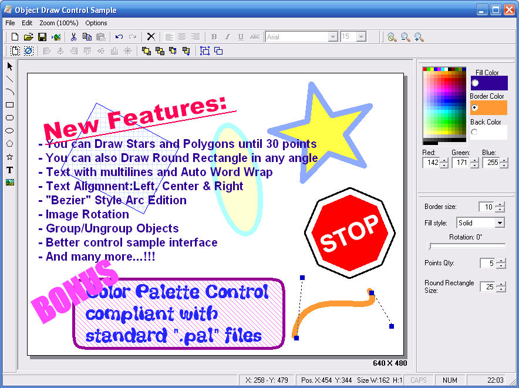



## Drawing Control \(Updated Version\)

### Description

This is a Drawing ocx control with multiple functions (similar to CorelDraw). In this version,You can Draw object like line, arc (with bezier), ellipse, rectangle, rounded rectangle, polygon, star, multi-lines text and image. You can edit objects size, rotation, color, border, aligmnent, position, etc... You can also group/ungroup objects, zoom-it, save to file, copy-paste, undo-redo, export to bmp...
 
### More Info
 

             |
---                |---
**Submitted On**   |2006-01-20 22:34:10
**By**             |[Christian Coutu](https://github.com/Planet-Source-Code/PSCIndex/blob/master/ByAuthor/christian-coutu.md)
**Level**          |Advanced
**User Rating**    |5.0 (120 globes from 24 users)
**Compatibility**  |VB 6\.0
**Category**       |[Graphics](https://github.com/Planet-Source-Code/PSCIndex/blob/master/ByCategory/graphics__1-46.md)
**World**          |[Visual Basic](https://github.com/Planet-Source-Code/PSCIndex/blob/master/ByWorld/visual-basic.md)
**Archive File**   |[Drawing\_Co1967221222006\.zip](https://github.com/Planet-Source-Code/christian-coutu-drawing-control-updated-version__1-63923/archive/master.zip)

